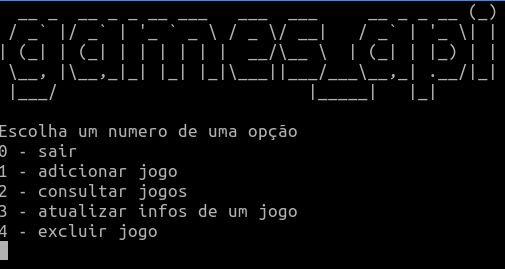

# Games api terminal (CRUD)

Programa de terminal feito em ruby com:
 - net http
 - json

Esse programa serve para exemplificar o uso do net http.

CRUD(create, read, update, delete)
consumindo de api:

https://github.com/xitarps/games_api

## Uso:

```
git clone https://github.com/xitarps/games_api_terminal.git
```

```
cd ./games_api_terminal
```

```
rb ./software_cli.rb
```
*requer ruby na máquina para rodar

## Exemplo:



*título gerado com figlet